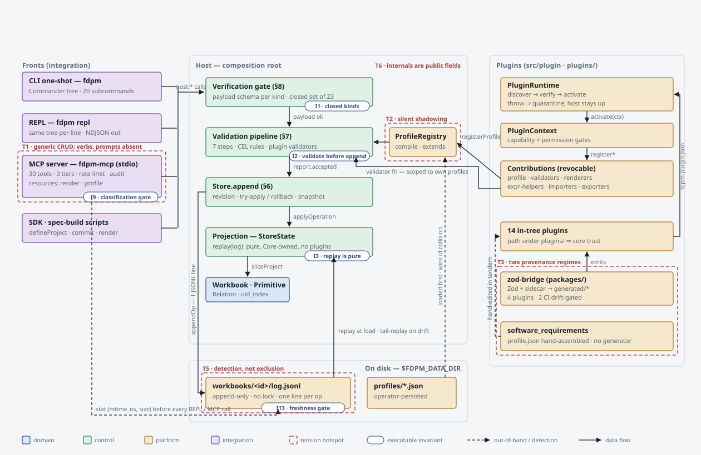

---
disclaimer:
  notice: >-
    No information within this document should be taken for granted.
    Any statement or premise not backed by a real logical definition
    or verifiable reference may be invalid, erroneous, or a hallucination.
  generated_by: "Claude Fable 5 via Claude Code (conceptual-codebase-analysis skill)"
  date: "2026-08-28"
status: "Architectural snapshot — branch ingest/sr-profile-plugin @ 78c7ff7 + uncommitted working tree"
scope: "fdpm-cli repository. Source volume and every other count live in the generated docs/architecture/CENSUS.md — this document deliberately states no figure it cannot regenerate."
---

# How FDPM Thinks — conceptual architecture, August 2026

## Disclaimer

This work is subject to the methodological caveats and commitments described in [@DISCLAIMER.md](../../DISCLAIMER.md).
> No statement or premise not backed by a real logical definition or verifiable reference should be taken for granted.

This is the second conceptual snapshot of the repository. The first ([docs/architecture/FDPM-ARCHITECTURE.md](../../docs/architecture/FDPM-ARCHITECTURE.md), 2026-05-05) covered ≈76K LOC and seven plugins. Since then the tree grew by ≈31K LOC, mostly plugins generated by `@fdpm/zod-bridge`; the core write path is unchanged. Section 11 lists what moved.

## Verification run (evidence baseline)

| Check | Result |
|---|---|
| `npm ci` + `packages/zod-bridge` build | clean |
| `tsc -p . --noEmit` | clean |
| `vitest run`, observed 2026-08-28 | **1 failed · 1156 passed · 3 skipped**, 89 s. A test count is a stopwatch reading, not a property of the tree — re-run rather than citing this. |
| Failing test | `tests/mcp-classification.test.ts` — `Host.registerPluginProfile` (uncommitted, [src/core/host.ts:585](../../fdpm-cli/src/core/host.ts#L585)) is neither an MCP tool nor listed in [src/mcp/not-exposed.ts](../../fdpm-cli/src/mcp/not-exposed.ts). The gate is working; the branch is not yet green. |

---

## 1. System thesis

> **FDPM is a single-writer, event-sourced ledger for typed graphs.** Every mutation — from the CLI, the REPL, the MCP server, the SDK, or a plugin transformer — becomes one immutable `Operation` drawn from a *closed* set of 23 kinds, is verified against a payload schema, validated against the workbook's `DomainProfile` on the proposed post-state, and only then appended to a per-workbook JSONL log from which all in-memory state is a pure, plugin-free replay. Plugins do not add write paths; they add *vocabulary* (profiles) and *judges* (validators, CEL rules) that the same pipeline consults. The two long-lived fronts (REPL, `fdpm-mcp`) share no process, so concurrency is handled by *detecting* out-of-band appends via `(mtime_ns, size)` of the log file, not by locking. The LLM reaches the ledger only through a hand-curated, three-tier MCP tool manifest whose authorization happens at dispatch, not at advertisement.

A reader who holds that paragraph can predict: a plugin cannot introduce `planning.task.complete` as an op kind today (closed set — [src/core/operations/kinds.ts:3-6](../../fdpm-cli/src/core/operations/kinds.ts#L3-L6)); an invalid primitive never reaches the log (validate-before-append — [src/core/host.ts:997-1011](../../fdpm-cli/src/core/host.ts#L997-L1011)); two MCP sessions against one data dir will refuse writes after the other's append until the operator SIGHUPs ([src/mcp/dispatch.ts:230-262](../../fdpm-cli/src/mcp/dispatch.ts#L230-L262)); and adding any public method to `Host` breaks the build until it is classified ([tests/mcp-classification.test.ts](../../fdpm-cli/tests/mcp-classification.test.ts) — observed live in this run).

**The gap that shapes the next year:** [PURPOSE.md](../../PURPOSE.md) describes an agent workbench driven by plugin-shipped *verbs, resources, prompts and expressions*. The code ships generic CRUD tools, one resource family, no prompt registration, and a plugin-tool stub that returns `[]` unconditionally ([src/mcp/plugin-tools.ts:44-63](../../fdpm-cli/src/mcp/plugin-tools.ts#L44-L63)). PURPOSE names "generic CRUD" as the failure mode the architecture exists to avoid; the README's status table is honest about this (verbs/prompts marked `v1`/`v2`, not `Shipped`), but a newcomer who reads PURPOSE first will look for `list_verbs` and not find it.

---

## 2. Boundary artifacts ingested, boilerplate subtracted

**Read first (contracts):** `src/core/operations/{kinds,operation,payloads}.ts`, `src/core/models/{meta,instance}.ts`, `src/plugin/manifest.ts` (plugin manifest Zod schema), `src/mcp/{manifest,not-exposed,types}.ts`, `src/core/errors/fdpm-exception.ts` (10-category taxonomy → exit codes/HTTP), `src/core/config/env.ts` (the `FDPM_*` registry — count in [CENSUS.md](./CENSUS.md)), `src/commands/index.ts` + `src/bin/program.ts` (20 Commander subcommands), `packages/zod-bridge/src/index.ts`, 13 SPECs under `docs/specs/`.

**Subtracted as plumbing/data (≈60% of LOC):**
- `fdpm-cli/scripts/build-spec-*.ts` (≈39K LOC): SPEC documents encoded as `defineProject` calls. They are *content*, regenerated into `docs/specs/*.md` — dogfooding, not logic. Drift between them and shared constants is tested ([tests/spec-builds-determinism.test.ts](../../fdpm-cli/tests/spec-builds-determinism.test.ts)).
- `plugins/*/generated/*.json`, `plugins/*/capabilities/*.json`: bridge outputs.
- `plugins/academic_paper_v0_4_1/`: a directory copy of `academic_paper` with `VENDOR = "acad041"` so the two can co-activate ([plugins/academic_paper_v0_4_1/sidecar.ts:141](../../fdpm-cli/plugins/academic_paper_v0_4_1/sidecar.ts#L141)).
  > **Update 2026-08-29:** `plugins/academic_paper/` (which registered `profile:academic-paper:0.3`) has been removed — the two profiles were identical apart from the namespace, and no workbook was bound to 0.3. `acad041` survives as the sole academic-paper vendor, so the discriminator now discriminates nothing.
- `src/commands/*.ts` and `src/mcp/tools/*.ts`: thin adapters over `Host.*` (Commander wiring, Zod I/O schemas).
- Root-level `acad_validate.py`, `price_quote.py`, `scripts/fdpm_to_latex.py`, `.repo/skills/` (119 tracked files), `static/`: out-of-band tooling; `price_quote.py` is a BRL pricing model unrelated to FDPM.

**Invisible edges to remember:** plugin discovery is *path-relative to the compiled module* (`resolve(__dirname, "..", "..", "plugins")`, [src/plugin/discovery.ts:40](../../fdpm-cli/src/plugin/discovery.ts#L40)) and a build step copies non-TS assets into `dist/plugins/` ([scripts/copy-plugin-assets.mjs](../../fdpm-cli/scripts/copy-plugin-assets.mjs)); trust tier is inferred from the *path* (`/cli/plugins/`, `/dist/plugins/` ⇒ `core`, [src/plugin/runtime.ts:741-758](../../fdpm-cli/src/plugin/runtime.ts#L741-L758)); the freshness gate keys off `TOOL_TO_COMMAND_METADATA` rows checked at module load ([src/mcp/manifest.ts:113-124](../../fdpm-cli/src/mcp/manifest.ts#L113-L124)).

---

## 3. Concept atlas (Lens 1)

| # | Concept | Class | What it is | Locus | Stability |
|---|---|---|---|---|---|
| 1 | **Workbook** | domain | The unit of state: one profile binding, one JSONL log, one revision counter. | [instance.ts:38](../../fdpm-cli/src/core/models/instance.ts#L38) | stable; name rename mid-flight (T4) |
| 2 | **Primitive / Relation** | domain | Typed node / typed edge with `id`, `uid` (ULID), `type_id`, `field_values`, `revision`. | [instance.ts:11-36](../../fdpm-cli/src/core/models/instance.ts#L11-L36) | stable |
| 3 | **DomainProfile** | domain/platform | The type system a workbook is bound to: categories, scopes, primitive/relation types, CEL rules, renderer bindings, `extends[]`. Accepts two spellings (CLI-native and legacy Python) and is compiled to one. | [meta.ts:395-430](../../fdpm-cli/src/core/models/meta.ts#L395-L430), [profile/compile.ts](../../fdpm-cli/src/core/profile/compile.ts) | stable; dual-spelling is accreted (ADR-0004) |
| 4 | **Operation** (closed kind set) | control | Immutable record: ULID `op_id`, `kind ∈ 23`, `payload`, `actor`, `plugin_id`, `revision`, `request_id`, `causation_op_id`, `schema_version`. | [kinds.ts](../../fdpm-cli/src/core/operations/kinds.ts), [operation.ts](../../fdpm-cli/src/core/operations/operation.ts) | stable by fiat — "adding one is a Core SPEC minor bump" |
| 5 | **Verification gate** | control | Payload-schema check per kind; the first of two gates. | [gate/verification-gate.ts](../../fdpm-cli/src/core/gate/verification-gate.ts) | stable |
| 6 | **Validation pipeline / ValidationReport** | control | 7 ordered steps (type → id format → required → per-field → CEL rules → custom validators → aggregate) on the *proposed* post-state; rejection is a report, not an exception, until `Host` converts it. | [pipeline.ts:22-37](../../fdpm-cli/src/core/validation/pipeline.ts#L22-L37) | stable; sync-only |
| 7 | **Store / projection** | control | `StoreState` = derived maps + `uid_index` + snapshots; `append` is the serialization point with try-apply/rollback. | [store.ts](../../fdpm-cli/src/core/store/store.ts), [state.ts](../../fdpm-cli/src/core/store/state.ts) | stable |
| 8 | **Replay** | control | Pure, Core-owned `applyOperation` switch with payload upcasting; "no plugin contributions". | [replay.ts:17-25](../../fdpm-cli/src/core/store/replay.ts#L17-L25) | frozen by spec |
| 9 | **Host** | control | Composition root: `store · profiles · pipeline · expr · renderDsl · persistence · plugins · workspace`; all fields public, atomically swapped by `reload()`. | [host.ts:114-160](../../fdpm-cli/src/core/host.ts#L114-L160) | stable; surface wide (T6) |
| 10 | **JSONL log + freshness stat** | platform | `workbooks/<id>/log.jsonl`, append-only; `(mtime_ns, size)` is the cross-process change signal. | [jsonl-log.ts](../../fdpm-cli/src/persistence/jsonl-log.ts) | stable; unlocked (T5) |
| 11 | **Plugin** (manifest · capabilities · permissions · trust · lifecycle) | platform | Manifest-declared module discovered → registered → auto-activated (`core`/`verified`) or `disabled`; any throw quarantines. | [plugin/manifest.ts](../../fdpm-cli/src/plugin/manifest.ts), [runtime.ts:64-200](../../fdpm-cli/src/plugin/runtime.ts#L64-L200) | stable; trust is nominal (T9) |
| 12 | **PluginContext** | platform | The only object `activate()` receives; each `register*` records a revocable contribution and gates by capability/permission. | [context.ts](../../fdpm-cli/src/plugin/context.ts) | stable |
| 13 | **ExpressionRuntime** (CEL + helper set v1.2.0) | platform | One CEL environment shared by validation rules and the render DSL; plugin helpers namespaced `fn.<plugin>.…`. | [expr/runtime.ts](../../fdpm-cli/src/core/expr/runtime.ts) | stable |
| 14 | **MCP tool (tiered) / resource / session** | integration | 12 read-only, 13 validating-write, 5 destructive tools; `render` and `profile` resource providers; per-session token bucket + freshness map. | [mcp/manifest.ts](../../fdpm-cli/src/mcp/manifest.ts), [mcp/session.ts](../../fdpm-cli/src/mcp/session.ts) | stable v0.1.2 |
| 15 | **zod-bridge** | platform | Deterministic compiler: Zod v4 schemas + `defineDomain()` sidecar → profile, validators, renderers, importers/exporters, manifest, `index.ts`. | [packages/zod-bridge](../../fdpm-cli/packages/zod-bridge) | v0.4.0; 4 plugins built with it |
| 16 | **DNIS** | domain | A second operation model (`create/edit/move/split/merge/retire/compact` on identity-stable nodes) mapped onto the core log via causation-linked batches with `uid == NID`. | [dnis/adapter.ts](../../fdpm-cli/src/core/dnis/adapter.ts), [host.ts:1060](../../fdpm-cli/src/core/host.ts#L1060) | stable; sole uid-pinning caller |

### Absent concepts (what the domain needs but the code does not reify)

- **Verb** — a plugin-namespaced operation kind. PURPOSE's central noun; the code's op-kind set is closed and the transformer emission type says `kind: string // must be in Core's closed set` ([plugin/types.ts:109](../../fdpm-cli/src/plugin/types.ts#L109)). *(High confidence.)*
- **Prompt** — no `registerPrompt` anywhere in `src/` (grep). *(High.)*
- **Actor identity** — `actor` is a free string defaulting to `"cli:operator"` ([store.ts:103](../../fdpm-cli/src/core/store/store.ts#L103)); the MCP audit log records a session id, not a principal. *(High.)*
- **Plugin-version migration** — payload upcasting exists ([operations/upcast.ts](../../fdpm-cli/src/core/operations/upcast.ts)) but there is no migration between profile versions; the workaround is a parallel plugin directory (`academic_paper_v0_4_1`). *(High.)* **Update 2026-08-29:** the parallel copy was collapsed by deleting the older plugin rather than by migrating anything, which is evidence for the tension rather than against it — the gap it names is still open.
- **Lock / lease** — only detection (`stale_state`), no exclusion. *(High.)*
- **Provenance link schema → profile** for hand-maintained profiles (see T3). *(High.)*

---

## 4. Computational model (Lens 2)

| Subsystem | Paradigm | Evidence |
|---|---|---|
| Core write path | Command → two gates → append → project (event-sourced state machine, single-threaded serialization by the JS event loop; `Store.append` is synchronous) | [store.ts:80-140](../../fdpm-cli/src/core/store/store.ts#L80-L140) |
| Validation | Ordered pipeline + rule engine (CEL predicates compiled once per expression, cached) | [pipeline.ts](../../fdpm-cli/src/core/validation/pipeline.ts), [expr/runtime.ts:112-120](../../fdpm-cli/src/core/expr/runtime.ts#L112-L120) |
| Plugin runtime | Lifecycle state machine: `discovered → registered → active | disabled | rejected | quarantined` | [plugin/types.ts:148-155](../../fdpm-cli/src/plugin/types.ts#L148-L155) |
| MCP server | Request-response over stdio with a 9-stage middleware chain; one session per process | [dispatch.ts:1-25](../../fdpm-cli/src/mcp/dispatch.ts#L1-L25) |
| REPL | Request-response; rebuilds the Commander tree per input line, NDJSON out | [bin/program.ts:1-24](../../fdpm-cli/src/bin/program.ts#L1-L24), [AGENTS.md](../../AGENTS.md) |
| zod-bridge | Pure compiler; byte-stable output gated by `--check` in CI | [packages/zod-bridge/README.md](../../fdpm-cli/packages/zod-bridge/README.md), `.github/workflows/plugin-acme-*.yml` |
| DNIS | Adapter between two op models (batch with shared `causation_op_id`) | [dnis/adapter.ts:1-40](../../fdpm-cli/src/core/dnis/adapter.ts#L1-L40) |

**Paradigm seams that cost something:** (a) two long-lived fronts share only the file system, so coordination is freshness-by-stat rather than a lock or a daemon; (b) the pipeline is synchronous, so a plugin that registers an async validator gets an `async-not-supported` *error finding* injected instead of its result ([context.ts:139-151](../../fdpm-cli/src/plugin/context.ts#L139-L151)); (c) Zod refinements outside the bridge's 23 CEL translation rows silently fall back to `safeParse` validators, i.e. the same constraint may be enforced at two different steps with two different `rule_id`s.

---

## 5. Invariants and their enforcement points (Lens 3)

| ID | Invariant | Enforced at | Evidence |
|---|---|---|---|
| I1 | Operation kinds are a closed set; unknown kind ⇒ `verification` | gate | [verification-gate.ts:14-18](../../fdpm-cli/src/core/gate/verification-gate.ts#L14-L18) |
| I2 | Validation runs on the proposed post-state before append; rejection never reaches the log | `Host.runWithValidation` | [host.ts:997-1011](../../fdpm-cli/src/core/host.ts#L997-L1011), ADR-0003 |
| I2′ | **Exception:** deletes and structure ops skip the pipeline (existence check only) | `Host.deletePrimitive/deleteRelation/reorder/reparent` | [host.ts:745-754](../../fdpm-cli/src/core/host.ts#L745-L754) — referential integrity of a delete is enforced at *apply* time via rollback, not by the pipeline |
| I3 | Replay is pure and Core-owned; byte-equal every run | `replay.ts` | comment [replay.ts:17-22](../../fdpm-cli/src/core/store/replay.ts#L17-L22); [tests/generator-determinism.test.ts](../../fdpm-cli/tests/generator-determinism.test.ts) |
| I4 | Revisions are contiguous; a gap on tail-replay is `host_compat` | `Store.appendReplayedOps` | [store.ts:296-330](../../fdpm-cli/src/core/store/store.ts#L296-L330) |
| I5 | Optimistic concurrency: `expected_project_revision` mismatch ⇒ `conflict` | `Store.append` | [store.ts:88-98](../../fdpm-cli/src/core/store/store.ts#L88-L98) |
| I6 | `uid_index` is maintained by the same replay handlers that mutate maps; DNIS `uid == NID` | replay + adapter | [state.ts:33-40](../../fdpm-cli/src/core/store/state.ts#L33-L40), [host.ts:55-66](../../fdpm-cli/src/core/host.ts#L55-L66) |
| I7 | Batches are atomic per workbook (projection *and* log restored) | `Store.appendBatch`, `Host.appendBatchWithCausation` | [store.ts:141-166](../../fdpm-cli/src/core/store/store.ts#L141-L166) |
| I8 | Plugin failure never crashes the host; a throw quarantines the plugin | `Host.load`, `PluginRuntime.quarantine` | [host.ts:203-214](../../fdpm-cli/src/core/host.ts#L203-L214), [runtime.ts:332-341](../../fdpm-cli/src/plugin/runtime.ts#L332-L341) |
| I9 | Every public `Host` method is either an MCP tool or explicitly not exposed | CI test | [tests/mcp-classification.test.ts](../../fdpm-cli/tests/mcp-classification.test.ts) — **currently failing** |
| I10 | MCP handlers never import `host.store` / `host.persistence` | CI test | [tests/mcp-source-imports.test.ts](../../fdpm-cli/tests/mcp-source-imports.test.ts) |
| I11 | Every command module exports freshness metadata | CI test | [tests/_meta/command-metadata-presence.test.ts](../../fdpm-cli/tests/_meta/command-metadata-presence.test.ts) |
| I12 | Tier-3 tools are refused at dispatch when destructive is off, regardless of advertisement | dispatcher | [dispatch.ts:107-122](../../fdpm-cli/src/mcp/dispatch.ts#L107-L122) |
| I13 | Tier-2/3 refuse on stale log; Tier-1 tail-replays silently | dispatcher + session | [dispatch.ts:217-262](../../fdpm-cli/src/mcp/dispatch.ts#L217-L262) |
| I14 | A plugin's validators fire only for profiles that plugin contributed | `makeContext` | [context.ts:118-133](../../fdpm-cli/src/plugin/context.ts#L118-L133) |
| I15 | `extends` chains have no cycles and no id collisions | `ProfileRegistry.resolve` | [registry.ts:69-135](../../fdpm-cli/src/core/profile/registry.ts#L69-L135) |
| I16 | Bridge output is byte-stable and matches the committed `generated/*` | CI `--check` | `.github/workflows/plugin-acme-*.yml` (2 of 5 generated plugins) |
| I17 | Cross-plugin slot uniqueness on `(target, rendererId)`, helper ids, transformer pairs | `PluginRuntime.install*` | [runtime.ts:407-420](../../fdpm-cli/src/plugin/runtime.ts#L407-L420) |

**Implicit invariants (assumed, not enforced):** single writer per data dir (JSONL append has no `flock`); persisted operator profiles take precedence over plugin profiles with the same id (new, silent — see T2); everything under `plugins/` is `core` trust because of its *path*.

**Violation markers:** one `TODO` in the whole `src/` tree ([pipeline.ts:469](../../fdpm-cli/src/core/validation/pipeline.ts#L469), §9 field attribution); `as any` confined to generated sidecars poking Zod internals; `fs:Section` marked `@deprecated` in favour of `dnis:Node`.

---

## 6. Information architecture (Lens 4)

**What each layer knows:**

- **Fronts** (CLI/REPL/MCP/SDK) know `Host.*` signatures and the error taxonomy. MCP additionally knows tier + freshness metadata per tool.
- **Host** knows everything and hides nothing structurally (`store`, `persistence`, `profiles`, `pipeline` are public fields, [host.ts:145-150](../../fdpm-cli/src/core/host.ts#L145-L150)); `host-extra.ts` is a bag of free functions that reach into `host.store` directly.
- **Plugins** know their own manifest, config, and the read views their permissions allow; they never see the log or other plugins.
- **zod-bridge** knows Zod ASTs and the profile shape; it never calls the host.

**Membranes (where data changes shape):**

1. Payload → `Operation`: [store.ts:100-113](../../fdpm-cli/src/core/store/store.ts#L100-L113) (mint ULID, revision, timestamp, request_id).
2. Legacy Python profile spelling → structured profile: [profile/compile.ts](../../fdpm-cli/src/core/profile/compile.ts) at registration.
3. Instance → CEL value: [expr/types.ts:33-70](../../fdpm-cli/src/core/expr/types.ts#L33-L70) (`field_values` → `fields`, Dates → ISO strings).
4. `FDPMException` → transport envelope: MCP ([dispatch.ts:439-470](../../fdpm-cli/src/mcp/dispatch.ts#L439-L470) — a `validation` throw on a Tier-2 tool becomes `{ok:false, validation_report}` with `isError:false`), REPL (`stderr` envelope + exit code).
5. Zod schema → `DomainProfile` + validator: [packages/zod-bridge/src/orchestrator.ts](../../fdpm-cli/packages/zod-bridge/src/orchestrator.ts).
6. DNIS operation → 1..n core operations under one `causation_op_id`: [dnis/adapter.ts](../../fdpm-cli/src/core/dnis/adapter.ts).

**Traced data item — a primitive from MCP to disk:** `tools/call fdpm.primitive.create` → dispatcher (tier gate, optional confirmation token, token bucket, freshness stat, Zod input parse, audit-start) → `host.createPrimitive` → `pipeline.runPrimitive(proposed, resolvedProfile, {relations})` → `store.append` (gate → revision → try-apply → commit) → `persistence.appendOp` → dispatcher re-seeds freshness for this session → `{ok, operation, validation_report, post_state_summary}`.

---

## 7. Capability map (Lens 5)

| Capability | Trigger / entry | Decision points | Failure paths |
|---|---|---|---|
| **C1 Model a domain as a typed graph** | `fdpm workbook create`, `fdpm.workbook.create`, `defineProject()` | profile must be registered; id regex `^[a-z0-9][a-z0-9-]*$` | `not_found`, `conflict` |
| **C2 Mutate with guaranteed validation** | `Host.create/replace/patch/fieldPatch*`, batch via `appendBatchWithCausation` | I2, I5, I7; field-patch revalidates only touched top-level paths | `validation` (report), `conflict`, `quota` (`FDPM_MAX_FIELD_PATCH_OPS`) |
| **C3 Replay, time-travel, undo, diff, audit** | `getProjectAt`, `undo` (inverse ops), `diffProject`, `buildAuditRecord` | snapshots every `FDPM_SNAPSHOT_EVERY_OPS` | `host_compat` on torn log |
| **C4 Validate and score** | `fdpm validate`, `src/quality/score-workbook.ts` (6-axis rubric, hard gates) | CEL rules + plugin validators + cardinality | findings, never throws |
| **C5 Render for humans** | `fdpm render`, `fdpm://workbook/{id}/render/{target}[#rendererId]` | renderer chosen by `(target, rendererId)`; size cap `FDPM_MAX_RENDER_BYTES` | `not_found`, `unsupported_media`, renderer findings |
| **C6 Extend by plugin** | `fdpm-plugin.json` in a search dir | manifest Zod parse → host-compat range → helper-set pin → trust → dependency order → `activate()` | `rejected` / `quarantined`; host warns and continues |
| **C7 Drive from an LLM** | `fdpm-mcp` (stdio only; HTTP flags refuse to start) | 30 tools / 3 tiers; `FDPM_MCP_ENABLE_DESTRUCTIVE`; rate limit; audit log (args hashed by default) | `permission` with `evidence.reason ∈ {destructive_disabled, rate_limited, stale_state, confirmation_required}` |
| **C8 Drive from scripts** | `fdpm repl --json --script`, `src/sdk.ts` | NDJSON contract; exit code = highest category seen | per-line envelopes on stderr |
| **C9 Author SPECs as workbooks** | 13 `scripts/build-spec-*.ts` → `docs/specs/*.md` | spec-authoring-dnis profile; DNIS section tree | drift test vs shared constants |
| **C10 Workspace identity, backup, restore** | `fdpm workspace *` | precedence `--data-dir > FDPM_DATA_DIR > FDPM_WORKSPACE > registry.current > default` | `host_compat` on profile drift |
| **C11 Generate a plugin from a Zod schema** | `plugins/<x>/scripts/run-bridge.ts` (+ `--check`) | sidecar `defineDomain()`; 23 CEL rows; feature flags | `BridgeError`, CI drift gate |

---

## 8. Flow narratives

### F1 — An LLM writes a primitive and gets the verdict back (integrity-critical)

The MCP client calls `fdpm.primitive.create`. The dispatcher resolves the tool, confirms it is not a disabled Tier-3 tool, strips/validates the optional `_confirmation_token`, consumes one token from the session bucket, then stats the workbook's `log.jsonl`. If `(mtime_ns, size)` differs from the session's last observation, the call is refused with `permission/stale_state` and the advice "operator must SIGHUP fdpm-mcp" — a Tier-2 tool never tail-replays. Otherwise the input is Zod-parsed, an audit-start row is written (args hashed unless `--audit-full-args`), and `host.createPrimitive` runs: mint a `uid`, build the proposed instance, run the seven-step pipeline against the resolved profile with the workbook's relations in context. A rejection throws `FDPMException("validation", {findings})`; the dispatcher deliberately turns that into `isError:false, ok:false, validation_report` — SPEC §12's rule that *a rejected operation is a successful protocol call*. On acceptance, `store.append` verifies the payload schema again, assigns `revision+1`, try-applies with rollback, commits to the in-memory log, and `persistence.appendOp` writes one JSONL line; the dispatcher then re-records the post-write stat so the session's next call does not see its own write as stale. *(Evidence: [dispatch.ts](../../fdpm-cli/src/mcp/dispatch.ts) whole file; [host.ts:644-670](../../fdpm-cli/src/core/host.ts#L644-L670); [store.ts:80-140](../../fdpm-cli/src/core/store/store.ts#L80-L140). Confidence: high — 14 `tests/mcp/*.test.ts` files exercise this path.)*

### F2 — A Zod schema becomes a plugin becomes a judge (most complex)

An author writes `schemas/<domain>.ts` in Zod v4 plus a `sidecar.ts` calling `defineDomain()` (entities, references, cascades, declared losses). `scripts/run-bridge.ts` invokes `assembleDomainProfileFromSidecar`, which walks the Zod AST, classifies each schema (entity vs struct by the `{Name}Id` convention or explicit override), maps fields, emits CEL for the 23 translatable refinement shapes and `safeParse`-backed validators for the rest, derives markdown renderers / importers / exporters / expr-helpers per entity, and writes byte-stable `generated/*.json`, `capabilities/*.json`, `fdpm-plugin.json`. At host start, discovery finds the manifest, `inferTrust` says `core` (it lives under `plugins/`), `activate()` re-runs the bridge in memory and refuses to start if the emitted profile id disagrees with `PROFILE_ID` (drift check), then `ctx.registerProfile / registerValidator / registerRenderer …`. From then on every write to a workbook bound to that profile is judged by CEL rules from the profile *and* the plugin's validators, the latter scoped to the plugin's own profile ids so `acme:Risk` from two decks cannot cross-fire. *(Evidence: [packages/zod-bridge/README.md](../../fdpm-cli/packages/zod-bridge/README.md); [plugins/academic_paper/index.ts:1139](../../fdpm-cli/plugins/academic_paper/index.ts#L1139); [context.ts:118-133](../../fdpm-cli/src/plugin/context.ts#L118-L133). Confidence: high for the four bridge plugins; **`software_requirements` does not follow this flow** — see T3.)*

### F3 — Two processes, one log (fragile)

An operator has `fdpm-mcp` running and, in another terminal, runs `fdpm primitive create …`. The one-shot CLI loads a fresh `Host` (replays the whole log), validates, appends one line. Back in the MCP session, the next Tier-1 read stats the file, sees a changed tuple, calls `host.reloadProjectTail`, which reads only the suffix and asserts revision contiguity (`host_compat` if the log was rewritten), applies it, and proceeds. The next Tier-2 write is refused as `stale_state` until the operator SIGHUPs the server (full `Host.reload`, atomic field swap). Nothing prevents *both* processes appending in the same millisecond; the tuple check catches it after the fact, and revision assignment in each process is based on its own in-memory log, so a true race yields two ops with the same `revision` on disk — which the next load will not detect (revisions are only checked on *tail* replay, not on full load). *(Evidence: [session.ts:1-30](../../fdpm-cli/src/mcp/session.ts#L1-L30); [host.ts:389-420, 523-577](../../fdpm-cli/src/core/host.ts#L389-L420); `loadFromOperations` sorts by revision without uniqueness check, [store.ts:270-285](../../fdpm-cli/src/core/store/store.ts#L270-L285). Confidence: medium-high — the race itself is not covered by a test; `tests/mcp/tier1-freshness.test.ts` and `tier2-stale-state.test.ts` cover detection.)*

### F4 — A plugin activates, and what happens when it lies (user-facing on every command)

`Host.load` first registers persisted operator profiles, then discovers plugins in `[<module>/../../plugins, $FDPM_PLUGIN_PATH…, ~/.fdpm/plugins]`. For each manifest: Zod-parse (invalid ⇒ warning, no record), duplicate id ⇒ `rejected`, host range or helper-set pin mismatch ⇒ `rejected`, else load the entry module. `activateAuto` walks dependency order and enables `core`/`verified` plugins; `community` ones become `disabled`. Inside `enable`, `onInstall` runs with a mutation-locked context, then `activate` with a live one; any throw — including a `conflict` from registering a `(target, rendererId)` another plugin already owns — quarantines the plugin, tears down its recorded contributions, and the host keeps going with a `plugin.quarantined` warning. The uncommitted change on this branch adds one more branch: a plugin profile whose id is already registered (because the operator persisted it) is now treated as "already-present" and silently skipped instead of throwing `conflict`. *(Evidence: [host.ts:161-220](../../fdpm-cli/src/core/host.ts#L161-L220); [runtime.ts:76-260](../../fdpm-cli/src/plugin/runtime.ts#L76-L260); working-tree diff of [context.ts:105-108](../../fdpm-cli/src/plugin/context.ts#L105-L108). Confidence: high.)*

---

## 9. Boundary contracts and drift assessment

| Boundary | Contract | Drift observed |
|---|---|---|
| PURPOSE/README ↔ code | Verbs, per-verb tools, prompts, expressions, discovery tools | README's status table marks these `v1`/`v2`/`v3` (planned). Code: closed op-kind set; `registerPrompt` absent; `discoverPluginTools` stub returns `[]` and warns `mcp.plugin_tools.unimplemented`. **Not a lie, but the architecture's thesis is unimplemented** (T1). |
| SPEC-MCP-SERVER ↔ `src/mcp` | Three tiers, freshness, audit, `ok:false` for rejections | Consistent; `types.ts:8` still says "v0.1 only ships Tier 1" — stale comment. |
| `Host` public surface ↔ MCP manifest | I9 | **Broken in the working tree** (`registerPluginProfile`). |
| Zod schema ↔ `generated/profile.json` | Byte-stable via `run-bridge --check` | Enforced for `acme_*` only (2 CI workflows); `academic_paper*` have the script but no workflow; `software_requirements` has **no generator at all** — schema (+75 lines) and profile.json (+1551 lines) were edited in tandem by hand on this branch. |
| `docs/specs/*.md` ↔ build scripts | Regenerated from workbooks; drift-tested | Consistent per `spec-builds-determinism.test.ts`. |
| `ErrorCategory` ↔ `HTTP_STATUS_FOR_CATEGORY` | 10 categories → HTTP status | Mapping is exported ([fdpm-exception.ts:55](../../fdpm-cli/src/core/errors/fdpm-exception.ts#L55)) but has had no consumer since the `web/` bridge was retired; it is dead until an HTTP front returns. |
| Manifest `trust.signature` ↔ runtime | Signed plugins become `verified` | Signature is never verified; only `signed_by ∈ FDPM_TRUSTED_KEYS` string match ([runtime.ts:760-766](../../fdpm-cli/src/plugin/runtime.ts#L760-L766)). PURPOSE documents trust as deferred; the *field* still implies more than it does. |
| `docs/architecture/FDPM-ARCHITECTURE.md` (May) ↔ tree | 7 plugins, 76K LOC | Plugin and LOC counts now live in [CENSUS.md](./CENSUS.md); the May doc is marked SUPERSEDED in place. Added since: `workspace`, `quality/`, bridge v0.4.0, the bridge-generated plugins. T2 (extends gate) and T3 (rename) from May are still open. |

---

## 10. Tension report (Lens 6)

### T1 — The architecture's thesis is not in the code yet (conflicting requirements + roadmap ahead of implementation)

PURPOSE says the primary user is a cold LLM agent and that "generic CRUD is the failure mode that motivated the verb / resource / prompt / expression design." What ships to that agent is 30 generic CRUD tools (`fdpm.primitive.create`, `fdpm.relation.patch`, …), one resource family, and a plugin-tool stub. The core's most load-bearing comment — "Plugins MUST NOT introduce new kinds" ([kinds.ts:3-6](../../fdpm-cli/src/core/operations/kinds.ts#L3-L6)) — is the exact opposite of PURPOSE's "plugins register verbs as first-class ops." The README's status table is candid about the gap, and the three-arm eval is designed as the falsification test.

*Cost today:* every new contributor must reconcile two documents that describe different systems. *Cost at scale:* the eval cannot run — arm 1 (verbs only) does not exist. *Confidence:* high.

*Direction:* the cheapest coherent move is to make "verb" a **registered payload schema + replay handler keyed by `plugin_id@semver`** on top of the existing gate, keeping `replay.ts` Core-owned by having plugins contribute *data* (a handler table) validated at activation — which is also what ADR-0002 already prefers. That is a Core SPEC minor bump by the code's own rule.

### T2 — The branch breaks its own gate, and the new behaviour is silent (in-flight change)

`Host.registerPluginProfile` ([host.ts:585-595](../../fdpm-cli/src/core/host.ts#L585-L595)) is unclassified, so `tests/mcp-classification.test.ts` fails. Fix is one line in `not-exposed.ts`. The deeper issue: the method makes a persisted operator profile *win* over a plugin's profile with the same id and returns `"already-present"` with no warning; the test named "does not replace an existing persisted profile with the same id" pins a `9.9.9` plugin profile losing to a persisted `1.0.0`. That is the right precedence (persisted profiles load first by design, [host.ts:161-170](../../fdpm-cli/src/core/host.ts#L161-L170)), but shadowing a newer plugin version silently is how a workbook ends up validated against a stale profile with no signal in `fdpm plugin list` or `fdpm health`. *Confidence:* high.

*Direction:* emit `emitHostWarning({code:"profile.plugin_shadowed", …})` with both versions, and surface it in `fdpm health`.

### T3 — Two provenance regimes for generated plugins (contract drift)

Four plugins are compiled from Zod by the bridge with an in-tree `run-bridge.ts` and (for two of them) a CI `--check` gate. `software_requirements` has `schemas/software-requirements.ts` and `generated/profile.json` but **no generator, no sidecar, no `--check`**; the working tree edits both by hand (`+75` / `+1551` lines). Nothing asserts that `srs:ScopeBoundary` in `profile.json` corresponds to `ScopeBoundary` in the Zod file — the new test checks the profile, not the correspondence. The `_ingest_bin/document-plan.schema.ts` (v3.1.0, 59 KB, open in the IDE) is the next candidate for the same path. Separately, `academic_paper` and `academic_paper_v0_4_1` coexist as two plugins with different vendors (`acad` / `acad041`) because there is no profile-version migration — the PURPOSE "plugin-version migration contract" is unimplemented, so versioning is done by directory copy (24 capability files ×2, 25 validators ×2). *Confidence:* high.

*Direction:* either run `software_requirements` through the bridge (sidecar + `run-bridge --check`, and add a workflow like `plugin-acme-*.yml`), or, if the profile is intentionally hand-shaped, add a `schema-hash.json` and a test that fails when the Zod source changes without a profile bump. Pick one; today it is neither.

### T4 — `project → workbook` rename is still mid-flight (historical accretion, carried over from May)

Ops are `workbook.*`, MCP tools are `fdpm.workbook.*`, but `Host` still exposes `createProject / deleteProject / getProject / listProjects / statProjectLog / reloadProjectTail`, and `ProjectStateSlice / ProjectTransfer / ProjectTemplate / ProjectBuilder` are public SDK types (66 + 24 + 23 + 20 + … occurrences). A `rename/project-to-workbook` branch exists; the rename script's own README already says "workbook to workbook" — it has been run once against its docs but not the code. *Confidence:* high.

### T5 — Concurrency by detection, not exclusion (design bet with an unguarded corner)

The JSONL append has no lock; the stat tuple detects *that* someone wrote, after the fact. For the REPL/MCP the refusal is loud and documented. The corner: two one-shot processes can each compute `revision = last+1` from their own in-memory log and both append — `loadFromOperations` then sorts by revision and silently keeps duplicates. The May doc did not list this. *Confidence:* medium — reasoned from code ([store.ts:270-285](../../fdpm-cli/src/core/store/store.ts#L270-L285)), not reproduced.

*Direction:* assert revision uniqueness in `loadFromOperations` (turn a silent corruption into `host_compat`), and take an advisory `flock` (or `O_EXCL` lock file) around `appendOp`.

### T6 — `Host` is the boundary in prose but not in type (leaky abstraction)

"The Host is the only object commands should hold," yet `store`, `persistence`, `profiles`, `pipeline` are public mutable fields (needed by `reload()`'s atomic swap), `host-extra.ts` reaches into them as free functions, and the July self-review ([docs/reviews/repo-review-20260713-weaknesses.json](../reviews/repo-review-20260713-weaknesses.json)) already flagged "broad package-root exports". The only executable guard is `tests/mcp-source-imports.test.ts`, scoped to `src/mcp`. *Confidence:* high.

### T7 — CI does not run on core changes (process gap)

Every workflow ([CENSUS.md](./CENSUS.md) lists them) is path-filtered to a single plugin, the zod-bridge, and that plugin's tests. **A commit touching `src/core/**` triggers nothing.** That is the gap: the code every plugin depends on is the code no workflow guards. The suite is also slow, because every `freshHost()` activates the whole plugin set and pays a cold start ([vitest.config.ts](../../fdpm-cli/vitest.config.ts) comment explains the 30 s timeout). *Confidence:* high.

### T8 — Root-level accretion (hygiene)

The repository root carries an unrelated pricing model (`price_quote.py`), Python academic tooling for a profile version (`0.3`) that the TS plugin has moved past (`0.4.1`), a large `.repo/skills` mirror, and 1.4 MB of `docs/drafts` JSON/TS. The 2026-08-29 doc-hygiene pass cleared the rest of what was listed here: `GEMINI.md` (an 11-line pointer stub) is deleted, the machine-specific `static/schemas/node_modules` symlink is untracked, and four unreadable `.repo/skills` index entries are gone. None of this breaks the build; all of it raises the cost of the "cold agent, first contact" test PURPOSE sets. *Confidence:* high.

### T9 — Trust tier is a label (misleading abstraction, acknowledged)

`trust.signature` and `supply_chain_sbom` exist in the manifest schema; the runtime checks neither. `verified` means "the `signed_by` string is in an env var." PURPOSE explicitly defers this, so it is a *known* gap; the risk is the field name promising more than the code does. *Confidence:* high.

**Design bets worth keeping (not problems):** JSONL as the canonical text format; validation rejection as a non-error MCP result; advertising disabled Tier-3 tools with a banner (the v0.1.2 reversal explained in [manifest.ts:170-185](../../fdpm-cli/src/mcp/manifest.ts#L170-L185)); rebuilding the Commander tree per REPL line for identical parse semantics; SPECs authored as workbooks; Zod as the plugin authoring language with a deterministic compiler.

---

## 11. What changed since the May snapshot

| Area | May 5 | Now |
|---|---|---|
| Plugins | 7 hand-written | Directory list and count in [CENSUS.md](./CENSUS.md). The mix is now hand-written, bridge-generated, composition profiles extending `profile:dnis:0.1`, and one hand-assembled from Zod (`software_requirements`, the only plugin with generated artifacts and no drift gate). |
| `@fdpm/zod-bridge` | trial journals | v0.4.0 with sidecar, scaffold, CI drift gate; 12 test files |
| Quality scoring | rubric draft | `src/quality/score-workbook.ts` + scoreboard (most plugins `weak`/`adequate` on minimal fixtures) |
| Workspace | new | `SPEC-WORKSPACE` v1.0 wired; registry + backup/restore |
| Web | 2 views | **retired** — the `web/` Vite browser and its Node bridge were removed; FDPM ships no HTTP front |
| Open from May | T2 extends gate, T3 rename | both still open (extends still "rubber-stamped"; rename residue 66 `getProject`) |

---

## 12. Onboarding path

1. [PURPOSE.md](../../PURPOSE.md) — then **immediately** the README "Implementation status" table, to learn which nouns exist and which are roadmap.
2. [src/core/operations/kinds.ts](../../fdpm-cli/src/core/operations/kinds.ts) + [operation.ts](../../fdpm-cli/src/core/operations/operation.ts) — the ledger entry and its closed vocabulary (60 lines; the most consequential file).
3. [src/core/models/instance.ts](../../fdpm-cli/src/core/models/instance.ts), then [meta.ts](../../fdpm-cli/src/core/models/meta.ts) — what a workbook holds; what a profile says.
4. [src/core/store/store.ts](../../fdpm-cli/src/core/store/store.ts) `append`, then [replay.ts](../../fdpm-cli/src/core/store/replay.ts) `applyOperation` — how an entry becomes state, and why replay must stay pure.
5. [src/core/host.ts](../../fdpm-cli/src/core/host.ts) — `load` (161), `runWithValidation` (997), `appendBatchWithCausation` (1060), `reload` (247).
6. [src/core/validation/pipeline.ts](../../fdpm-cli/src/core/validation/pipeline.ts) header — the seven steps.
7. [src/plugin/manifest.ts](../../fdpm-cli/src/plugin/manifest.ts) → [context.ts](../../fdpm-cli/src/plugin/context.ts) → [runtime.ts](../../fdpm-cli/src/plugin/runtime.ts) — what a plugin may do, and what happens when it throws.
8. [src/mcp/manifest.ts](../../fdpm-cli/src/mcp/manifest.ts), [not-exposed.ts](../../fdpm-cli/src/mcp/not-exposed.ts), [dispatch.ts](../../fdpm-cli/src/mcp/dispatch.ts) — the LLM-facing surface and its gates.
9. [tests/mcp-classification.test.ts](../../fdpm-cli/tests/mcp-classification.test.ts), [tests/mcp-source-imports.test.ts](../../fdpm-cli/tests/mcp-source-imports.test.ts), [tests/_meta/command-metadata-presence.test.ts](../../fdpm-cli/tests/_meta/command-metadata-presence.test.ts) — the invariants that are *executable*.
10. One plugin: [plugins/_starter](../../fdpm-cli/plugins/_starter) (hand-written) and [plugins/acme_pitch_deck](../../fdpm-cli/plugins/acme_pitch_deck) (bridge-generated), then [packages/zod-bridge/README.md](../../fdpm-cli/packages/zod-bridge/README.md).

Skip on first pass: `scripts/build-spec-*.ts`, `src/commands/*`, `src/mcp/tools/*`, everything at the repository root except PURPOSE/CLAUDE/AGENTS.

---

## 13. Change impact guide

**CI-A — Introduce plugin verbs (the T1 move).** Touches `kinds.ts` (open the enum or add a registered-kind path), `payloads.ts` (schema table), `verification-gate.ts`, `replay.ts` (handler dispatch must stay deterministic → handlers registered as data, keyed by `plugin_id@semver`), `inverse.ts` (undo), `upcast.ts`, `plugin/types.ts` + `context.ts` (`registerVerb`), `mcp/manifest.ts` + `tool-metadata-map.ts` (per-verb tools and their freshness extractors), `not-exposed.ts`, `tests/mcp-classification`, `tests/operation-schema-contract`. Propagation risk: any op kind that reaches a log must be replayable forever — the migration contract in PURPOSE becomes mandatory the day the first plugin verb is persisted. Complexity: L.

**CI-B — Add a public `Host` method (e.g. finishing `registerPluginProfile`).** Add to `NOT_EXPOSED` (or wire a tool + `EXPOSED_HOST_METHODS`), and if it is command-reachable, add `commandMetadata`. The classification test tells you within 90 s. Complexity: XS.

**CI-C — Ingest `_ingest_bin/document-plan.schema.ts` as a plugin.** Two paths exist; choose the bridge path (sidecar + `run-bridge.ts` + `--check` workflow) so schema→profile provenance is mechanical. Watch for: `rendererId` collisions across plugins (I17 — a collision quarantines the *later* plugin at every start); the `VENDOR` prefix must be unique; `.superRefine` cross-field rules are outside the 23-row table and become `safeParse` validators. Complexity: M.

**CI-D — Finish the `project → workbook` rename.** ~200 identifier sites in `src/` plus the SDK's exported type names (`ProjectBuilder`, `ProjectTransfer`, … are public API — semver-major for `@fdpm/cli`). The rename script exists; run it on a branch, then fix `not-exposed.ts`/`EXPOSED_HOST_METHODS` strings by hand (they are string literals the script's `\b` rules will catch, but the classification test is the safety net). Complexity: M.

---

## 14. Architecture map

 Nodes are colour-coded by classification (domain / control / platform / integration); dashed red outlines mark tensions T1, T2, T3, T5, T6; pills mark executable invariants I1, I2, I3, I9, I13.

---

## 15. Compression ratio

16 concepts + 12 capabilities + 4 flows + 9 tensions = **41 conceptual items** (source volume in [CENSUS.md](./CENSUS.md)). One over the ≤40 target; T9 could fold into T1's "documented deferrals" without loss, but it is kept separate because the manifest field name is the concrete thing a reader will trip on.

**Confidence tally:** high 31 · medium 3 · low 0. Claims not backed by a test run or a line reference are marked "reasoned from code".
