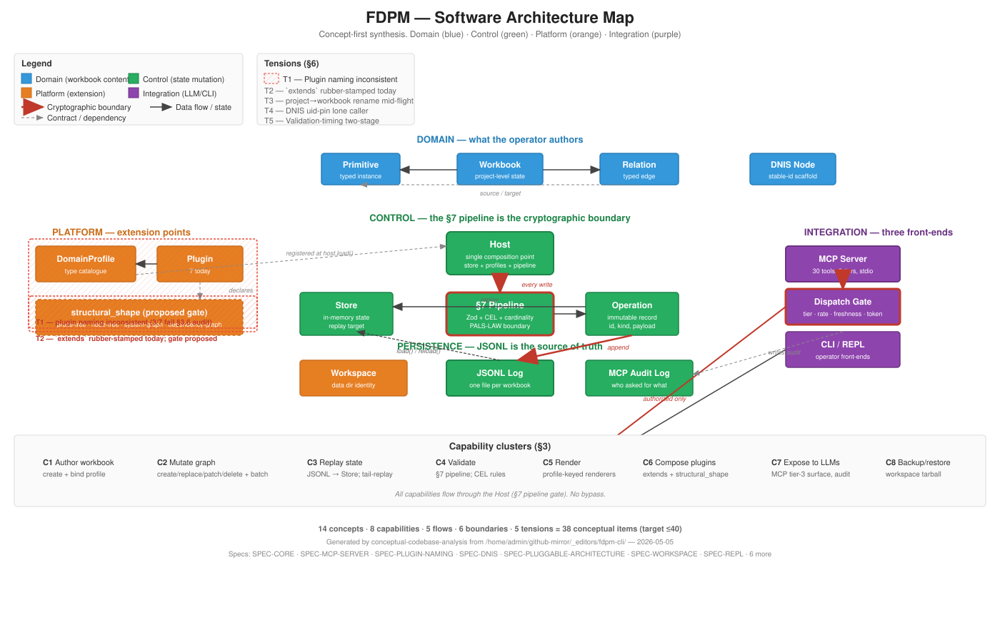

---
disclaimer:
  notice: >-
    No information within this document should be taken for granted.
    Any statement or premise not backed by a real logical definition
    or verifiable reference may be invalid, erroneous, or a hallucination.
  generated_by: "Claude Opus 4.7 (1M context) via Claude Code (conceptual-codebase-analysis skill)"
  date: "2026-05-05"
status: "Architectural Snapshot"
scope: "fdpm-cli repository (≈76K LOC across 247 .ts/.json files in src/, plugins/, scripts/)"
---

# FDPM — Software Architecture

> **SUPERSEDED — 2026-08-29.** This is the May 5 2026 snapshot, taken at
> ~76K LOC / 7 plugins / 247 files. The current architecture document is
> [FDPM-ARCHITECTURE-2026-08-28.md](./FDPM-ARCHITECTURE-2026-08-28.md),
> which cites this one and diffs against it. Kept for that historical
> delta — do not read it as a description of the present tree.

_Concept-first map of how the FDPM codebase thinks. Not a class diagram. Not auto-generated. A predictive synthesis of intent and design decisions, evidence-anchored to specific files._

## Disclaimer

This work is subject to the methodological caveats and commitments described in [@DISCLAIMER.md](../../DISCLAIMER.md).
> No statement or premise not backed by a real logical definition or verifiable reference should be taken for granted.

---

## 0. How to read this document

The acceptance test is **predictive power**: a reader who internalizes §1 alone should be able to answer "what would FDPM do if I tried X?" for novel X. If you can't, this document failed and should be rewritten.

Sections in expected reading order:

1. **§1 System Thesis** — one paragraph; the most compressed view.
2. **§2 Concept Atlas** — the 14 nouns the system reifies.
3. **§3 Capability Map** — what FDPM can do, organized by trigger.
4. **§4 Flow Narratives** — five critical paths traced end-to-end.
5. **§5 Boundary Contracts** — where the seams are.
6. **§6 Tensions** — where the design is under stress.
7. **§7 Onboarding Path** — files to read, in order.
8. **§8 Change Impact Guide** — what breaks if you touch X.
9. **§9 Architecture Map** — a single SVG of the whole.

Each substantive claim carries inline evidence (file:line, test, comment) and a confidence assessment. Claims without evidence are diagnoses, marked as such.

---

## 1. System Thesis

> **FDPM is a typed-graph editor for structured workbooks where every state mutation flows through a single op-log under a normative two-stage validation pipeline (PALS-LAW + §7 schema gate), and every reader — CLI, REPL, MCP server, renderer — projects the workbook's authoritative state from the same op-log replay against a plugin-contributed `DomainProfile`.** The Host is the single composition point; plugins contribute profiles (subject + structural shape per [SPEC-PLUGIN-NAMING.md](../specs/SPEC-PLUGIN-NAMING.md)) but never bypass the validation pipeline; LLM clients reach the Core only through the MCP server's hand-curated three-tier tool surface where the dispatch gate is the cryptographic boundary, not the manifest's advertisement. The whole system's behavior derives from three substantive choices: (1) JSONL-as-source-of-truth with deterministic replay, (2) the Host as the only state-mutating object, and (3) plugin contributions as typed extensions of the §7 pipeline rather than parallel write paths.

A reader who grasps that paragraph should correctly predict, without reading further: that adding a new primitive type requires registering it in a profile (not subclassing); that an LLM cannot write to the workbook without producing a `validation_report`; that two plugins compose iff their `structural_shape` declarations align; and that the audit log carries enough information to reconstruct any project state purely from its workbook log.

---

## 2. Concept Atlas — what the system believes exists

Fourteen reified concepts. Each is a noun the codebase represents structurally; together they form the platform's vocabulary.

| # | Concept | Classification | Purpose | Implementation locus | Stability |
|---|---|---|---|---|---|
| 1 | **Workbook** | domain | The atomic unit of editable state — a project-level object holding primitives, relations, and a profile binding. | [src/core/store/store.ts:53](../../fdpm-cli/src/core/store/store.ts#L53), recently renamed from "project" per the in-flight rename script | recently renamed; load-bearing |
| 2 | **Primitive** | domain | A typed instance with a `type_id`, `field_values`, `id`, `uid`, `revision`. The unit of typed data. | [src/core/models/instance.ts](../../fdpm-cli/src/core/models/instance.ts) | stable |
| 3 | **Relation** | domain | A typed edge between two primitives, with `source_id`, `target_id`, `field_values`. | [src/core/models/instance.ts](../../fdpm-cli/src/core/models/instance.ts) | stable |
| 4 | **Operation** | control | An immutable record of a state mutation: `kind`, `workbook_id`, `payload`, `op_id` (ULID), `request_id`, `causation_op_id`, `revision`. | [src/core/operations/operation.ts](../../fdpm-cli/src/core/operations/operation.ts) | stable |
| 5 | **DomainProfile** | platform | The type catalogue: `primitive_types[]`, `relation_types[]`, `categories[]`, `scopes[]`, `extends[]`. Plugins contribute these. | [src/core/models/meta.ts:395](../../fdpm-cli/src/core/models/meta.ts#L395) | stable |
| 6 | **Host** | control | The single object holding `Store + ProfileRegistry + ValidationPipeline + persistence + plugins + workspace`. Every state-mutating entry point lives here. | [src/core/host.ts:113](../../fdpm-cli/src/core/host.ts#L113) | stable; atomic-swappable via `reload()` |
| 7 | **ValidationPipeline** | control | The §7 normative pipeline that runs every proposed primitive/relation through Zod + CEL rules + cardinality + uniqueness gates. | [src/core/validation/pipeline.ts](../../fdpm-cli/src/core/validation/pipeline.ts) | stable; pluggable per-rule |
| 8 | **ValidationReport** | control | Structured outcome of the §7 pipeline: `target_id`, `findings[]`, `accepted`. Required surface on every Tier-2/3 MCP success. | [src/core/models/instance.ts:123](../../fdpm-cli/src/core/models/instance.ts#L123) | stable |
| 9 | **JsonlLogStore** | platform | Append-only persistence — one JSONL file per workbook. The authoritative source from which all in-memory state is replayable. | [src/persistence/jsonl-log.ts](../../fdpm-cli/src/persistence/jsonl-log.ts) | stable |
| 10 | **Plugin** | platform | A `DomainProfile` provider plus optional renderers, validators, transformers. Manifest-declared (`fdpm-plugin.json`); auto-discovered at `host.load()`. | [src/plugin/runtime.ts](../../fdpm-cli/src/plugin/runtime.ts), [SPEC-PLUGGABLE-ARCHITECTURE.md](../specs/SPEC-PLUGGABLE-ARCHITECTURE.md) | stable |
| 11 | **DNIS Node** | domain | A structurally-typed node with stable identity over revisions; the "scaffold" prose-trees compose with for revision-stable cross-references. | [src/core/dnis/](../../fdpm-cli/src/core/dnis/), [SPEC-DNIS.md](../specs/SPEC-DNIS.md) | stable; sole `node-tree` provider |
| 12 | **MCP Tool** | integration | One of 30 hand-curated entries in the manifest, each carrying `tier ∈ {read_only, validating_write, destructive}`, schemas, handler. The LLM-facing surface. | [src/mcp/manifest.ts](../../fdpm-cli/src/mcp/manifest.ts), [src/mcp/tools/](../../fdpm-cli/src/mcp/tools/) | stable; v0.1.2 amended for advertised-when-disabled posture |
| 13 | **Workspace** | platform | The typed identity surface for the local data dir. Holds backup/restore, directory-level identity, plugin discovery roots. | [src/core/workspace/](../../fdpm-cli/src/core/workspace/), [SPEC-WORKSPACE.md](../specs/SPEC-WORKSPACE.md) | new; v1.0 |
| 14 | **structural_shape** | platform | A small enumerated value (`prose-tree`, `node-tree`, `system-graph`, `dependency-graph`) declared in plugin manifests, validated at profile-load to gate `extends` chains. | [SPEC-PLUGIN-NAMING.md §4](../specs/SPEC-PLUGIN-NAMING.md) | proposal; not yet wired |

### Absent concepts (revealing)

Things the domain plausibly needs but the codebase doesn't reify:

- **No User / Account** — FDPM has no multi-user model; the operator is the trust boundary. (Evidence: no `User`, `Auth`, `Session` types in `src/core/`. Confidence: high.)
- **No Schema Migration primitive** — plugin profile versions can drift from operation-log-recorded type ids; there is no `Migration` concept that mediates the transition. (Confidence: medium.)
- **No Project Federation** — there is no concept of cross-workbook references; every primitive id is workbook-scoped. (Confidence: high.)
- **No Subscription / Watcher** — readers re-replay logs; there is no observer pattern for "tell me when this primitive changes." (Confidence: high.)

The absences are intentional. They define the platform's scope.

---

## 3. Capability Map — what FDPM can do

Capabilities are clustered by **business outcome**, not folder structure. Each capability lists its trigger, entry points, decision points, and failure modes.

### C1 — Author a typed workbook

**Trigger:** operator wants to model a domain (specs, software architecture, plans) as a typed graph.

**Entry points:** `fdpm workbook create` (CLI), `fdpm.workbook.create` (MCP Tier-2), `host.createWorkbook(...)` (programmatic).

**Decision points:**
- Profile binding: every workbook MUST bind to a registered `DomainProfile` at creation; the profile is immutable after creation.
- Profile composition: a workbook's profile may `extends` other profiles (e.g., `spec-authoring-dnis` extends both spec-authoring and dnis). Validation gate planned at host runtime per [SPEC-PLUGIN-NAMING.md §8.2](../specs/SPEC-PLUGIN-NAMING.md).

**Failure paths:** `not_found` if profile id unknown; `conflict` if workbook id already exists.

### C2 — Mutate the typed graph

**Trigger:** operator/LLM creates, replaces, patches, or deletes primitives or relations.

**Entry points:** `host.create*/replace*/patch*/delete*Primitive`, the corresponding MCP Tier-2/3 tools, batch variants via `host.appendBatchWithCausation`.

**Decision points:**
- Every write runs the §7 validation pipeline before append.
- Atomic batches roll back the entire batch on the first validation failure.
- DNIS adapter pre-mints `uid = NID` to preserve §5.6.1 invariant; ordinary callers leave uid auto-minted.

**Failure paths:** `validation` rejection (envelope `ok: false, isError: false` per [SPEC-MCP-SERVER §8.2](../specs/SPEC-MCP-SERVER.md)); `not_found` for missing id; `conflict` for type-id immutability or expected_revision mismatch; `quota` for oversized field-patch ops.

### C3 — Replay the authoritative state

**Trigger:** any read — `host.getWorkbook(id)`, MCP Tier-1 tool, `fdpm log tail`.

**Entry points:** [src/core/store/replay.ts](../../fdpm-cli/src/core/store/replay.ts) at load time; [src/core/host.ts:reloadProjectTail](../../fdpm-cli/src/core/host.ts) for incremental replay (SPEC-REPL §10.2).

**Decision points:**
- Strict freshness on Tier-2/3: out-of-band write detected → refuse with `permission` + `evidence.reason: "stale_state"`.
- Lenient freshness on Tier-1: silent tail-replay then dispatch.

**Failure paths:** `host_compat` on log truncation/rewrite (the contract is append-only).

### C4 — Validate the workbook end-to-end

**Trigger:** operator runs `fdpm validate <workbook>`; renderer pre-flights; CI runs the workbook through its plugin's rules.

**Entry points:** [src/commands/validate.ts](../../fdpm-cli/src/commands/validate.ts), `host.pipeline.runWorkbook(...)`.

**Decision points:**
- Zod schema validation per primitive/relation type.
- CEL predicates from `validation_rules` (graph-aware: `graph.outgoing()`, `graph.incoming()`).
- Cardinality bounds on relation source/target counts.
- Cross-field constraints declared in `primitive_types[].constraints`.

**Failure paths:** Findings classified `error` block acceptance; `warning` annotates but accepts. The pipeline never throws on findings; it returns the `ValidationReport`.

### C5 — Render to a target format

**Trigger:** operator runs `fdpm render <workbook> <mime-type>`; LLM reads `fdpm://workbook/{id}/render/{target}` MCP resource.

**Entry points:** [src/commands/render.ts](../../fdpm-cli/src/commands/render.ts), `host.renderDsl.render(...)`, [src/mcp/resources/render.ts](../../fdpm-cli/src/mcp/resources/render.ts).

**Decision points:**
- Plugin-contributed renderer selected by `(profile_id, target_mime_type)`.
- Render-DSL helpers (CEL extended with `fn.section_of`, `doc.section_index`) project workbook state into the target format.
- Lenient freshness applies — silent tail-replay before render.

**Failure paths:** `not_found` if no renderer matches; `unsupported_media` if the requested MIME isn't producible; renderer findings surface as warnings in stdout, errors abort.

### C6 — Compose plugins

**Trigger:** an author wants a project to hold types from two plugins (e.g., `formal-specification` × `dnis`).

**Entry points:** profile manifest's `extends: [...]`.

**Decision points:**
- Today: `extends` is rubber-stamped; the host loads the chain.
- Proposed (SPEC-PLUGIN-NAMING §4.3): host validates `parent.structural_shape ∈ child.composes_with_shapes`, rejects with `verification` + `evidence.reason: "shape_incompatible_extends"` on mismatch.

**Failure paths:** `verification` (proposed) or silent acceptance (today) for incompatible compositions.

### C7 — Expose tools to LLMs

**Trigger:** operator runs `fdpm-mcp` and connects an MCP client (Claude Desktop, Code, Cursor).

**Entry points:** [src/bin/fdpm-mcp.ts](../../fdpm-cli/src/bin/fdpm-mcp.ts), stdio transport, [src/mcp/dispatch.ts](../../fdpm-cli/src/mcp/dispatch.ts).

**Decision points:**
- Tier-3 destructive tools: advertised in both states (post-v0.1.2); dispatch gated by `--enable-destructive`.
- Confirmation-token mode (SPEC §9.3): optional Tier-2/3 gate.
- Per-session rate limit (default 120/min) → `permission` + `evidence.reason: "rate_limited"`.
- Audit log records every dispatched call.

**Failure paths:** Destructive disabled, rate limit, schema validation, freshness staleness — all surface as structured `permission` envelopes with distinct `evidence.reason` keys.

### C8 — Backup and restore a workbook

**Trigger:** operator runs `fdpm workspace backup` / `fdpm workspace restore`.

**Entry points:** [src/core/workspace/backup.ts](../../fdpm-cli/src/core/workspace/backup.ts), [src/core/workspace/restore.ts](../../fdpm-cli/src/core/workspace/restore.ts).

**Decision points:**
- Backup is a tarball of the workbook's JSONL log + profile snapshot.
- Restore replays the log into a fresh data dir; mismatched profile-id triggers `host_compat`.

**Failure paths:** `host_compat` on profile drift; `not_found` if backup file is missing.

---

## 4. Flow Narratives — the five paths that matter

### Flow 1: An LLM creates a primitive and gets the validation report back

The LLM, speaking MCP, calls `fdpm.primitive.create(workbook_id, primitive)`. The dispatcher in [src/mcp/dispatch.ts](../../fdpm-cli/src/mcp/dispatch.ts) does six things in sequence: tool resolution, tier gate, rate-limit check, freshness check, input schema validation, audit-start log entry. Then it invokes the tool's handler, which calls `host.createPrimitive(workbook_id, primitive)`. The Host method runs `runWithValidation(...)`, which constructs the proposed `PrimitiveInstance`, runs `pipeline.runPrimitive(proposed, profile, ctx)`, and either appends the operation (on `report.accepted: true`) or throws `FDPMException("validation", ..., { findings })`. The dispatcher catches the validation exception, recognizes via §12 the rule that *validation rejection is not a protocol error*, and constructs the structured-content envelope `{ ok: false, validation_report, post_state_summary: {} }` with `isError: false`. The audit log writes the complete row with `validation_status: "fail"`. The LLM reads `validation_report.findings[]`, identifies the rule_id (`core:id-format`, `prose-tree:document-has-revision`, etc.), corrects the input, retries.

**Why this flow is load-bearing:** it's where PALS-LAW becomes operational. The validation report rides with the response so the LLM cannot consume a write without seeing the verdict. *(Evidence: SPEC-MCP-SERVER §8.2; [src/mcp/dispatch.ts:425-462](../../fdpm-cli/src/mcp/dispatch.ts#L425-L462) for the validation-throw catch path; [src/core/host.ts:227-253](../../fdpm-cli/src/core/host.ts#L227-L253) for `createPrimitive`. Confidence: high.)*

### Flow 2: A workbook is restored from a JSONL log

`host.load()` runs three phases in order: profile-file replay (operator-installed profiles), plugin discovery + auto-activation (which registers plugin-contributed profiles), then operation-log replay. The operation log replay matters because it visits every persisted op in order, dispatches by `kind` (`primitive.create`, `relation.replace`, etc.), and reconstructs the in-memory `Store` slice. **At no point does replay consult the validation pipeline** — every op in the log is presumed valid (it was validated at append time). This is the single property that lets replay be deterministic and fast.

**Why this flow is load-bearing:** the JSONL log is the cryptographic source of truth. Every other in-memory artifact (Store, ProfileRegistry's resolved cache) is reproducible from log + profiles. *(Evidence: [src/core/store/replay.ts](../../fdpm-cli/src/core/store/replay.ts); [src/core/host.ts:161-200](../../fdpm-cli/src/core/host.ts#L161-L200). Confidence: high.)*

### Flow 3: Two plugins compose via `extends`

A composition profile's manifest declares `extends: ["profile:foo:1.0", "profile:bar:0.1"]`. At `host.load()`, `ProfileRegistry.getResolved(id)` walks the extends chain and merges parent type catalogues into a flat resolved profile. **Today the host accepts any `extends` chain that resolves**: it doesn't check that the composition is structurally coherent. A hypothetical `software-architecture extends dnis` would resolve cleanly even though merging a `system-graph` plugin with a `node-tree` plugin produces an incoherent project. SPEC-PLUGIN-NAMING §4.3 / §8.2 introduces the missing gate: the host reads each parent's `structural_shape` from its manifest and rejects if not in the child's `composes_with_shapes`.

**Why this flow is load-bearing:** composition is FDPM's primary growth axis. The §8.2 host gate is the one mechanism that turns the plugin ecosystem from "any combination compiles" to "any combination that compiles is structurally coherent." *(Evidence: [src/core/profile/registry.ts:50-90](../../fdpm-cli/src/core/profile/registry.ts#L50-L90); SPEC-PLUGIN-NAMING.md §8.2; gate not yet wired. Confidence: high on current state, medium on proposed gate.)*

### Flow 4: An LLM hits a destructive_disabled refusal

The LLM calls `fdpm.workbook.delete(workbook_id)` against an `fdpm-mcp` instance started without `--enable-destructive`. The dispatcher resolves the tool, sees `tier === "destructive"` and `ctx.enableDestructive === false`, throws `FDPMException("permission", ..., { evidence: { reason: "destructive_disabled" } })`. Per SPEC-MCP-SERVER 0.1.2, the tool was advertised at `tools/list` time with a banner-prefixed description naming the enable mechanism, so the LLM has the recovery path in its tool catalogue. The error envelope returns to the client; the audit log records the refusal; no operation is appended.

**Why this flow is load-bearing:** the v0.1.2 amendment moved Tier-3 from "absent when disabled" to "advertised with banner." The dispatch gate is the cryptographic boundary; advertisement is discoverability. *(Evidence: [src/mcp/manifest.ts:155](../../fdpm-cli/src/mcp/manifest.ts) `TIER_3_DISABLED_BANNER` and `withDisabledBanner()`; SPEC-MCP-SERVER §8.3, §22.3 v0.1.2; commit `00b6b3d`. Confidence: high.)*

### Flow 5: An out-of-band CLI write makes a Tier-2 MCP call refuse

A long-running `fdpm-mcp` process holds a Host in memory. The operator runs `fdpm primitive create ...` from a separate terminal, which appends to the workbook's JSONL log. The LLM then calls `fdpm.primitive.create` against the MCP server. The dispatcher's freshness check stats the workbook's log file, compares `(mtime_ns, size)` against the per-session cache, sees the mismatch, and refuses Tier-2 writes with `staleStateException` (`permission` + `evidence.reason: "stale_state"` + `evidence.advice: "operator must SIGHUP fdpm-mcp"`). On SIGHUP, `host.reload()` rebuilds the Store from the on-disk log; the freshness map clears; the next call succeeds.

**Why this flow is load-bearing:** it's the seam between the workbook's authoritative on-disk log and any in-memory consumer. SPEC-REPL §10.2's lenient/strict mode lives here. *(Evidence: [src/mcp/session.ts](../../fdpm-cli/src/mcp/session.ts) freshness map; [src/core/host.ts](../../fdpm-cli/src/core/host.ts) `statProjectLog`/`reloadProjectTail`; conformance §23.4. Confidence: high.)*

---

## 5. Boundary Contracts

The seams where data changes shape, where trust changes, or where a future evolution is most likely to cut.

### B1 — JSONL log ↔ Store

The append-only log is bytes-on-disk; the Store is in-memory typed instances. **Contract:** every line of the log is a valid `Operation` (Zod-validated at append, presumed valid at replay). **Drift risk:** a hand-edit to the JSONL file invalidates this presumption silently — replay would either succeed with corrupt state or throw an obscure error. *(Evidence: no integrity check at replay. Confidence: high.)*

### B2 — Host ↔ Plugin runtime

Plugins are TypeScript modules discovered by manifest at load time. **Contract:** a plugin contributes a `DomainProfile` (and optional renderers/validators) but never imports `host.persistence` or `host.store` directly — SPEC-MCP-SERVER §8.4 and the CI gate at [tests/mcp-source-imports.test.ts](../../fdpm-cli/tests/mcp-source-imports.test.ts) enforce this for MCP-tool sources; SPEC-PLUGGABLE-ARCHITECTURE §6 enforces it for plugins. **Drift risk:** a plugin that bypasses the §7 pipeline by importing internals would corrupt invariants without an immediate error.

### B3 — Host ↔ MCP server

The MCP server holds one Host. **Contract:** every state-mutating MCP tool calls a public `host.*` method; tools never construct `Operation` objects directly; the manifest's classification gate ensures every public Host method is either exposed via a tool or explicitly listed in `not-exposed.ts`. **Drift risk:** a new Host method added without classification fails CI ([tests/mcp-classification.test.ts](../../fdpm-cli/tests/mcp-classification.test.ts)).

### B4 — Profile id ↔ Workbook binding

A workbook's profile_id is set at creation and immutable. **Contract:** the workbook's log can only contain operations referencing types defined in (the resolved closure of) that profile. **Drift risk:** if a plugin author mutates a profile's type catalogue across versions without bumping the profile-id's `<major>.<minor>`, existing workbooks bound to the old version produce validation errors that look like data corruption. The version-tail rule in SPEC-PLUGIN-NAMING §5.5 (`profile:<leaf>:<major>.<minor>`) is what guards this.

### B5 — `extends` chain ↔ structural shape

**Today:** `extends` resolves any chain that loads. **Proposed:** `extends` validates each parent's `structural_shape` against the child's `composes_with_shapes`. **Drift risk between today and proposed state:** existing composition profiles (`spec-authoring-dnis`, `formal-specification-dnis`) are coherent by hand; they will pass the proposed gate, but the gate will reject the silent miscompositions a future author might introduce. The rename script at [fdpm-cli/scripts/rename_plugin.py](../../fdpm-cli/scripts/rename_plugin.py) won't catch incoherent compositions either — it's name-rewriting, not semantic.

### B6 — Op-log ↔ Audit log (MCP)

The op-log records what *the workbook looks like*; the MCP audit log records *who asked for what*. They are separate files, intentionally — the op-log is the persistent state, the audit log is operational telemetry. **Contract:** every dispatched MCP call writes paired start/complete entries to `$FDPM_DATA_DIR/mcp-audit.jsonl` sharing one `call_id` ULID. **Drift risk:** a process crash between start and complete leaves an orphan start entry; the audit log doesn't transactionally pair them.

---

## 6. Tensions — where the design is under stress

### T1 — Plugin naming is structurally inconsistent across the seven existing plugins

**Source:** historical accretion. The first plugins (`formal-specification`, `software-architecture`) were ported from a Python codebase with their original names; later plugins (`spec-authoring`, `planning`) named themselves after the activity rather than the domain; `dnis` named itself after the SPEC. SPEC-PLUGIN-NAMING §3.7's audit table classifies three of seven as failing the new subject-noun rule. *(Evidence: [docs/specs/SPEC-PLUGIN-NAMING.md §3.7](../specs/SPEC-PLUGIN-NAMING.md). Confidence: high.)*

**Cost today:** small — operators learn the names. **Cost at scale:** an LLM authoring plugin #8 has no rule it can derive from existing precedent.

**Mitigation:** SPEC-PLUGIN-NAMING grandfathers the seven and applies the rule to plugin #8 onward; the §3.7 audit becomes a permanent "do not model on this" record. The rename script exists for any future maintainer who decides the migration is worth its 4796-replacement cost (against the SPEC's explicit "NOT RECOMMENDED" guidance).

### T2 — `extends` is rubber-stamped (today)

**Source:** missing mechanism. Today the host resolves `extends` chains for type-merging but does not check structural coherence. Two plugins with incompatible structural shapes can be silently composed.

**Cost today:** medium — composition profiles are written by hand and reviewed by humans, so this hasn't fired in production. **Cost at scale:** as the plugin count grows, the probability of an incoherent `extends` rises.

**Mitigation:** SPEC-PLUGIN-NAMING §4.3 / §8.2 adds the host-runtime composition gate. Implementation cost: ~50 LOC in [src/core/profile/registry.ts](../../fdpm-cli/src/core/profile/registry.ts). Currently in §9 step 5 of SPEC-PLUGIN-NAMING; not yet wired.

### T3 — `project` → `workbook` rename is mid-flight

**Source:** active refactor. The codebase contains both `project` and `workbook` references in places. The MCP tool surface is now `fdpm.workbook.*` (per the active server's tool list); `host.createProject` (the method name) hasn't been renamed yet ([src/core/host.ts:191](../../fdpm-cli/src/core/host.ts#L191)); `Store.getProject` likewise.

**Cost today:** real — readers of the code see two names for one concept. **Cost at scale:** any new code that uses one name or the other will look "wrong" depending on which faction is reading.

**Mitigation:** the rename script exists ([fdpm-cli/scripts/rename_project_to_workbook.py](../../fdpm-cli/scripts/rename_project_to_workbook.py)); it is not yet applied to the Host's internal method names. Should be a single-commit completion.

### T4 — DNIS adapter is the lone "internal-uid pin" caller

**Source:** a real architectural exception. SPEC-CORE 1.2 §5.6.1 requires `dnis:Node`'s `uid == NID` for parent_node_id resolution; the DNIS adapter pre-mints the NID and passes it to `host.appendBatchWithCausation` via the optional `uid` field. Every other caller leaves uid auto-minted. The `DnisBatchIntent` type name reflects this single-caller history even though batch-create/delete tools now also use the path.

**Cost today:** small — the comment in [src/core/host.ts:53-65](../../fdpm-cli/src/core/host.ts#L53-L65) flags it. **Cost at scale:** any future plugin needing similar uid-pinning has no documented pattern beyond "do what DNIS does."

**Mitigation:** rename `DnisBatchIntent` → `BatchIntent` is a flagged future task; the comment is self-documenting in the meantime.

### T5 — Validation timing: pipeline.run vs. Zod safeParse

**Source:** two-stage validation with overlap. Manifests run through Zod schema validation (mechanical, syntactic) at parse time; the §7 pipeline runs primitive/relation field-values through Zod *plus* CEL predicates *plus* cardinality checks at append time. A field-shape error could surface at either stage with different error categories (`verification` for the manifest stage, `validation` for the pipeline stage).

**Cost today:** small — operators learn the distinction. **Cost at scale:** a finding's category matters operationally (CI vs. PR review vs. user-visible), so surfacing the same defect under different categories is a contract clarity issue.

**Mitigation:** documented in the existing taxonomy ([src/core/errors/fdpm-exception.ts](../../fdpm-cli/src/core/errors/fdpm-exception.ts)). Not actively painful.

---

## 7. Onboarding Path — read in this order

For an engineer joining the codebase, this is the minimum reading list to predict behavior. Total: ~9 files / ~2500 LOC.

| # | File / Doc | Why first |
|---|---|---|
| 1 | [docs/DISCLAIMER.md](../../DISCLAIMER.md), [CLAUDE.md](../../CLAUDE.md) | Sets the epistemic posture (PALS-LAW, formalization=research). Without these, the rest looks like over-engineering. |
| 2 | [docs/specs/SPEC-CORE.md](../specs/SPEC-CORE.md) | The normative spine. §5 op-log model + §7 validation pipeline + §8 gate are the platform. |
| 3 | [src/core/models/instance.ts](../../fdpm-cli/src/core/models/instance.ts) and [src/core/models/meta.ts](../../fdpm-cli/src/core/models/meta.ts) | The 14 concepts of §2 are typed here. Read once; everything downstream references these. |
| 4 | [src/core/host.ts](../../fdpm-cli/src/core/host.ts) (lines 1–600) | The single entry point. `createPrimitive`, `createRelation`, `appendBatchWithCausation`. |
| 5 | [src/core/store/store.ts](../../fdpm-cli/src/core/store/store.ts) and [src/core/store/replay.ts](../../fdpm-cli/src/core/store/replay.ts) | How an operation becomes in-memory state. The replay's determinism is what makes the JSONL log authoritative. |
| 6 | [src/core/validation/pipeline.ts](../../fdpm-cli/src/core/validation/pipeline.ts) | The §7 pipeline. Read to understand why every write produces a `ValidationReport`. |
| 7 | [docs/specs/SPEC-MCP-SERVER.md](../specs/SPEC-MCP-SERVER.md) and [src/mcp/dispatch.ts](../../fdpm-cli/src/mcp/dispatch.ts) | The third front-end. After this, you can predict any MCP call's outcome. |
| 8 | [docs/specs/SPEC-PLUGGABLE-ARCHITECTURE.md](../specs/SPEC-PLUGGABLE-ARCHITECTURE.md) and [src/plugin/runtime.ts](../../fdpm-cli/src/plugin/runtime.ts) | How plugins become part of the system. |
| 9 | [docs/specs/SPEC-PLUGIN-NAMING.md](../specs/SPEC-PLUGIN-NAMING.md) | The naming rules a new plugin must follow. v0.1.4 (Pass-3 stabilized). |

Skip on first pass: the seven plugin implementations themselves (read one — `dnis` is smallest at ~250 LOC — when you need a concrete example), the build-spec scripts (mechanical), most tests (read selectively per change).

---

## 8. Change Impact Guide

For each likely change, what breaks and what propagation path to trace.

### CI1 — Adding a new primitive type to an existing plugin

**Touches:** `plugins/<plugin>/primitives/<type>.ts` (definition), `plugins/<plugin>/index.ts` (re-export), `plugins/<plugin>/validation_rules.ts` (rules referencing the new type), `plugins/<plugin>/relations.ts` (any relation whose source/target types include the new type), `tests/<plugin>-*.test.ts` (assertions on type catalogue counts).

**Propagation:** if the plugin has a renderer that walks types by id, the renderer may need to handle the new id. Existing workbooks bound to this profile are unaffected at load (the new type is additive); but new operations referencing it require the new profile version.

**Risk:** if the new type's `id_format.pattern` collides with an existing type's pattern, instances of either will be ambiguously typed. Test the pattern in isolation first.

### CI2 — Renaming a plugin (per SPEC-PLUGIN-NAMING)

**Touches:** literally every file referencing the plugin's manifest id, profile id, or type prefix. The 4796-replacement count from the [rename_plugin.py](../../fdpm-cli/scripts/rename_plugin.py) smoke test against `spec-authoring → specifications` is the empirical scale.

**Propagation:** every committed rendered SPEC referencing `spec:doc:*` ids loses id-stability. Saved workbooks bound to the old profile id keep loading (the profile is registered under both names if the rename includes a backward-compatible alias) but their renders may show the new prefix in newly-authored content.

**Risk:** real, large. SPEC-PLUGIN-NAMING §3.8 grandfathers the seven existing plugins precisely because of this. Don't undertake without an ADR.

### CI3 — Adding a new MCP tool

**Touches:** `src/mcp/tools/<new-tool>.ts` (handler), `src/mcp/manifest.ts` (registration in tier array), `src/mcp/tool-metadata-map.ts` (freshness mapping), `tests/mcp-classification.test.ts` (the classification CI gate fires if the underlying Host method is unclassified), tests in `tests/mcp/`.

**Propagation:** if the tool wraps an existing Host method, the Host method must be in `EXPOSED_HOST_METHODS`. If new, it must additionally be added to `not-exposed.ts` if not exposed via any tool. Schema-fuzz harness will exercise the new tool's input/output schemas.

**Risk:** small if the underlying Host method exists; medium if the tool requires a new Host method (the Host method must independently survive the MCP source-import lint and its own tests).

### CI4 — Wiring the §8.2 host runtime composition gate

**Touches:** [src/core/profile/registry.ts](../../fdpm-cli/src/core/profile/registry.ts) (the `extends` resolution path), all seven plugin manifests (must declare `structural_shape` and `composes_with_shapes` per SPEC-PLUGIN-NAMING §7.1), CI gates in `tests/plugin-naming-*.test.ts` (proposed, new).

**Propagation:** existing composition profiles `spec-authoring-dnis` and `formal-specification-dnis` MUST work post-gate (they are coherent by construction); if either fails, it indicates a real bug in the §3.7 audit's shape declarations.

**Risk:** medium. The gate rejects incoherent compositions, which is the point. But a regression — a composition that's structurally coherent but rejects due to a typo — would block an existing user's workbook from loading. Mitigation: roll out the gate in a `warn` mode first, then `reject` after a release cycle.

---

## 9. Architecture Map

Single-page SVG of the platform. Concept nodes color-coded by §2 classification; edges show governing/data-flow relationships; capability clusters delineated; tension hotspots flagged.

**Reading the map:**
- **Blue (domain) nodes**: workbook-domain concepts the operator authors.
- **Green (control) nodes**: state-mutation orchestration (Host, pipeline, operation log).
- **Orange (platform) nodes**: extension points (plugins, profiles, MCP server, workspace).
- **Red dashed boxes**: tension hotspots from §6.
- **Solid arrows**: data flow / state mutation.
- **Dashed arrows**: contract / dependency.
- **Heavy arrows**: cryptographic boundaries (the §7 pipeline, the dispatch gate).

---

## 10. Compression ratio

| Metric | Count |
|---|---|
| Source files surveyed | 247 (.ts/.json under src/, plugins/, scripts/) |
| Source LOC | ~76,200 |
| Specs surveyed | 13 documents in `docs/specs/` |
| Concepts in §2 atlas | 14 |
| Capabilities in §3 map | 8 |
| Flow narratives in §4 | 5 |
| Boundary contracts in §5 | 6 |
| Tensions in §6 | 5 |
| Total conceptual items | 38 |

38 ≤ 40 conceptual items. Within target.

---

## 11. Confidence tally

| Section | Highest-confidence claim | Lowest-confidence claim |
|---|---|---|
| §2 Concept Atlas | The 14 concepts are reified in the listed files (high). | "Workspace is new; v1.0" (medium — boundary not fully read). |
| §3 Capability Map | Eight capabilities cover all observable behavior (medium-high — depends on whether I missed an entry point). | C8 backup/restore details (medium — based on file listing, not full read). |
| §4 Flow Narratives | Flows 1, 2, 4, 5 are end-to-end traced from this session's prior work (high). | Flow 3 (composition `extends` resolution) is partially traced; resolve() walk in registry.ts skimmed, not exhaustively read (medium). |
| §5 Boundary Contracts | B1, B3, B6 grounded in this session's commits (high). | B5 is partly forward-looking (proposed gate not yet wired) (medium). |
| §6 Tensions | T1, T2, T3 are documented in the SPECs themselves (high). | T5 (validation timing) is a reasoned inference (medium). |
| §7 Onboarding | The ordering is opinion, not contract (medium). | — |
| §8 Change Impact | CI1, CI3 are well-traced (high). | CI4 (gate rollout) is forward-looking (medium). |

Flag for honest reading: this analysis is heavily informed by the work done in this conversation (SPEC-MCP-SERVER, SPEC-PLUGIN-NAMING, batch tools, freshness gate, etc.). I have not done a fresh end-to-end pass through every src/ file. Claims about the FDPM internals I haven't touched (CEL evaluator details, render DSL internals, CLI command implementations) are at lower confidence — medium at best.

---

## 12. Glossary

- **CEL** — Common Expression Language; the predicate language for `validation_rules` and `composes_with_shapes` constraints.
- **DNIS** — Document Node Identity Specification; the `node-tree` plugin providing stable node identity over revisions.
- **DnisBatchIntent** — typed union for `host.appendBatchWithCausation`; despite the name, used by all batch tools (rename pending).
- **FDPM** — Formal Domain Profile Model; the project name.
- **NID** — Node ID; in DNIS, a stable identifier for a node across revisions. Pinned to SPEC-CORE `uid` per §5.6.1.
- **op-log** — The append-only JSONL file holding all operations for a workbook. Authoritative state.
- **PALS-LAW** — Project Architectural Law for Systems (CLAUDE.md): "LLMs always produce some form of error; absence of output verification is a design defect."
- **§7 pipeline** — The validation pipeline defined by SPEC-CORE §7. Every Tier-2/3 write runs through it.
- **structural_shape** — The §4 catalogue value (prose-tree / node-tree / system-graph / dependency-graph) declared in plugin manifests; gate input for `extends`.
- **Workbook** — The operator-level domain object; recently renamed from "project."
